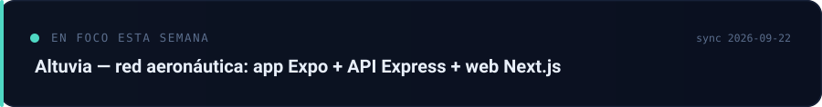

<div align="center">

<picture>
  <source media="(prefers-color-scheme: dark)"  srcset="assets/hero-dark.svg">
  <source media="(prefers-color-scheme: light)" srcset="assets/hero-light.svg">
  
</picture>

### [`▶  abrir la consola interactiva`](https://fervicente8.github.io/fervicente8/)

<sub>una terminal de verdad, en el navegador: escribí <code>help</code>, <code>projects</code> o <code>radar</code><br><code>english</code> switches it to English</sub>

</div>

<br>

<picture>
  <source media="(prefers-color-scheme: dark)"  srcset="assets/status-dark.svg">
  <source media="(prefers-color-scheme: light)" srcset="assets/status-light.svg">
  
</picture>

<br>

Construyo productos completos: app móvil, web y API. Casi todo en **TypeScript** — **Next.js** del lado web, **Expo / React Native** en mobile, **Node + Postgres o Mongo** en el servidor. Me gusta la parte que no se ve en el screenshot: el modelo de datos, los estados raros, y que la cosa siga andando el lunes a la mañana.

<br>

## Proyectos

| Proyecto | Qué es | Stack | |
|---|---|---|---|
| **PlaySpot** | Plataforma global de torneos para cualquier deporte: web pública, panel de administración y API REST. | `Next.js 16` `Prisma` `Postgres` `Auth.js` `next-intl` `Capacitor` | [ver ↗](https://playspotapp.vercel.app/es) |
| **Altuvia** | Red aeronáutica: vuelos, hangares, combustible, marketplace de aeronaves y paneles de gestión. Publicada en tiendas. | `Expo` `React Native` `Express` `MongoDB` `Next.js` `Leaflet` | [web ↗](https://altuvia.net) · [App Store ↗](https://apps.apple.com/ar/app/altuvia/id6768280890) · [Play ↗](https://play.google.com/store/apps/details?id=com.altuvia.app) |
| **Generala Online** | Generala multijugador en tiempo real: salas, amigos, estadísticas y PWA instalable. | `Next.js` `Socket.IO` `Prisma` `Auth.js` | [jugar ↗](https://generala-8zq4.onrender.com/) · [código ↗](https://github.com/fervicente8/generala) |
| **Boxer Containers** | Sitio y cotizador de contenedores marítimos, con panel interno. | `React` `Vite` `Express` `Radix UI` `Tailwind` | [ver ↗](https://boxer-containers.vercel.app) |
| **Alfa Prop** | Marketplace inmobiliario mobile-first con match inteligente, chats y visitas. Monorepo con workspaces. | `Expo SDK 54` `Supabase` `Postgres` `React Query` `Zustand` | [ver ↗](https://alfaprop.net) |
| **Scannex AI** | Trazabilidad de agroquímicos y semillas, con escaneo OCR en el dispositivo. | `Expo` `ML Kit` `Express` `MongoDB` `Redis` `SQL Server` | [ver ↗](https://scannexai-app.expo.app) |
| **Clubop** | Gestión de clubes deportivos: socios, accesos y notificaciones. | `Expo` `Express` `MongoDB` `Cloud Run` | [ver ↗](https://www.clubop.com.ar) |

<br>

## Tech radar

<sub>Los **cuadrantes** dicen en qué parte del producto vive cada cosa. Los **anillos**, qué tanto la uso.</sub>

<picture>
  <source media="(prefers-color-scheme: dark)"  srcset="assets/radar-dark.svg">
  <source media="(prefers-color-scheme: light)" srcset="assets/radar-light.svg">
  
</picture>

<br>

## Más

<details>
<summary><code>~ $ fer how-i-work</code></summary>

<br>

- **Primero el flujo, después la pantalla.** Si el recorrido del usuario no cierra, ningún componente lo salva.
- **Tipos en todos lados.** TypeScript estricto y `zod` en los bordes: lo que entra desde afuera se valida.
- **Monorepo cuando comparten dominio.** App, API y web hablando el mismo lenguaje, no tres verdades distintas.
- **Deploy temprano.** Prefiero algo chico en producción que algo grande en `localhost`.
- **Lo aburrido importa.** Migraciones, correos transaccionales, estados de error, i18n.

</details>

<details>
<summary><code>~ $ fer stack --all</code></summary>

<br>

| Área | Herramientas |
|---|---|
| **Lenguajes** | TypeScript · JavaScript · SQL |
| **Web** | Next.js (App Router) · React · Tailwind CSS · next-intl · Framer Motion · Astro |
| **Mobile** | Expo · React Native · Expo Router · Reanimated · Capacitor · ML Kit |
| **Backend** | Node.js · Express · Prisma · Auth.js (NextAuth) · Zod · Socket.IO · Nodemailer |
| **Datos** | PostgreSQL (Neon) · MongoDB / Mongoose · Supabase · Redis · SQL Server |
| **Infra** | Vercel · Docker · Cloud Run · Cloudinary · GitHub Actions |
| **Testing** | Vitest · ESLint |

</details>

<details>
<summary><code>~ $ fer --lang en</code>  ·  <b>English</b></summary>

<br>

**Fermín Vicente** — full-stack developer based in Tandil, Argentina (UTC−3).

I build products end to end — mobile app, web and API — mostly in TypeScript: **Next.js** on the web,
**Expo / React Native** on mobile, **Node with Postgres or Mongo** on the server. I care about the parts
that never show up in a screenshot: the data model, the weird states, and the thing still running on Monday.

| Project | What it is | Stack | |
|---|---|---|---|
| **PlaySpot** | Global tournament platform for any sport: public site, admin panel and REST API. | `Next.js 16` `Prisma` `Postgres` `Auth.js` `next-intl` | [live ↗](https://playspotapp.vercel.app/en) |
| **Altuvia** | Aviation network: flights, hangars, fuel, aircraft marketplace and management dashboards. Shipped to both app stores. | `Expo` `React Native` `Express` `MongoDB` `Next.js` | [web ↗](https://altuvia.net) · [App Store ↗](https://apps.apple.com/ar/app/altuvia/id6768280890) · [Play ↗](https://play.google.com/store/apps/details?id=com.altuvia.app) |
| **Generala Online** | Real-time multiplayer dice game: rooms, friends, stats and an installable PWA. | `Next.js` `Socket.IO` `Prisma` `Auth.js` | [play ↗](https://generala-8zq4.onrender.com/) · [code ↗](https://github.com/fervicente8/generala) |
| **Alfa Prop** | Mobile-first real estate marketplace with smart matching, chats and visits. | `Expo SDK 54` `Supabase` `Postgres` `React Query` | [live ↗](https://alfaprop.net) |
| **Scannex AI** | Traceability for agrochemicals and seeds, with on-device OCR scanning. | `Expo` `ML Kit` `Express` `MongoDB` `Redis` | [live ↗](https://scannexai-app.expo.app) |
| **Clubop** | Sports club management: members, access control and notifications. | `Expo` `Express` `MongoDB` `Cloud Run` | [live ↗](https://www.clubop.com.ar) |
| **Boxer Containers** | Shipping container catalogue and quote tool, with an internal panel. | `React` `Vite` `Express` `Tailwind` | [live ↗](https://boxer-containers.vercel.app) |

Most of my repositories are private (client and product work), so this profile links to the running
products instead of the source. **Generala Online** is open source if you want to read some code.

Reach me at **[fferminvicente@gmail.com](mailto:fferminvicente@gmail.com)**.

</details>

<details>
<summary><code>~ $ cat .github/how-this-readme-works</code></summary>

<br>

Este perfil no usa servicios de terceros para las imágenes: todo lo que ves es SVG generado acá.

```bash
node scripts/build-assets.mjs   # regenera header, radar y tarjeta de estado (dark + light)
```

- `scripts/build-assets.mjs` — genera los SVG. El radar se dibuja a partir de una lista de
  tecnologías: cada anillo reparte sus items sobre el cuadrante, y el barrido enciende cada blip
  justo cuando lo cruza.
- `data/profile.json` — de acá sale el "en foco esta semana".
- `.github/workflows/refresh.yml` — corre todos los días y vuelve a commitear los assets si cambian.
- `docs/index.html` — la consola interactiva, un solo archivo sin dependencias, servida por GitHub Pages.

Animaciones respetan `prefers-reduced-motion` y los colores siguen el tema claro/oscuro de GitHub.

</details>

<br>

## Contacto

**[fferminvicente@gmail.com](mailto:fferminvicente@gmail.com)**  ·  Tandil, Argentina (UTC−3)

<sub>La mayoría de mis repos son privados (trabajo de producto y de clientes), así que arriba linkeo los productos funcionando en vez del código. <a href="https://github.com/fervicente8/generala">Generala</a> es open source.</sub>
